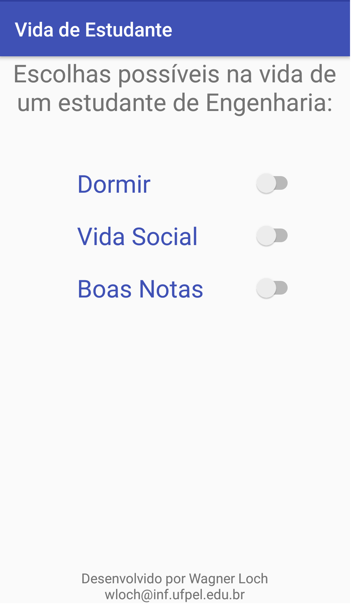
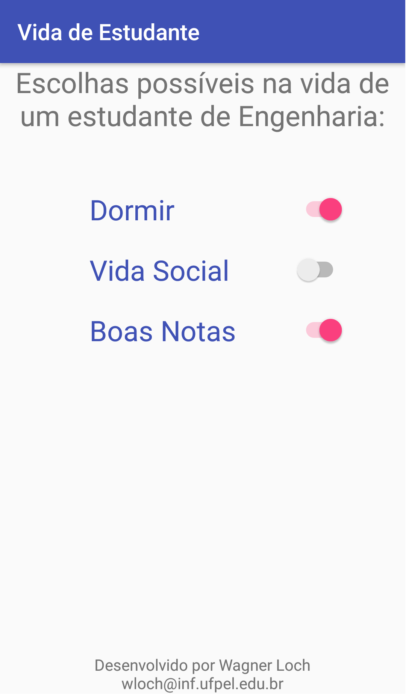
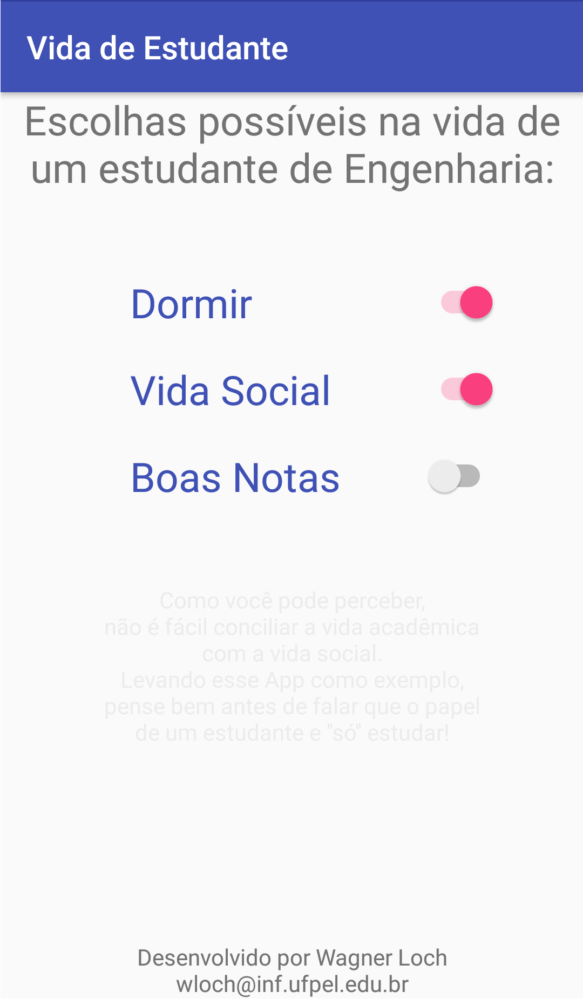
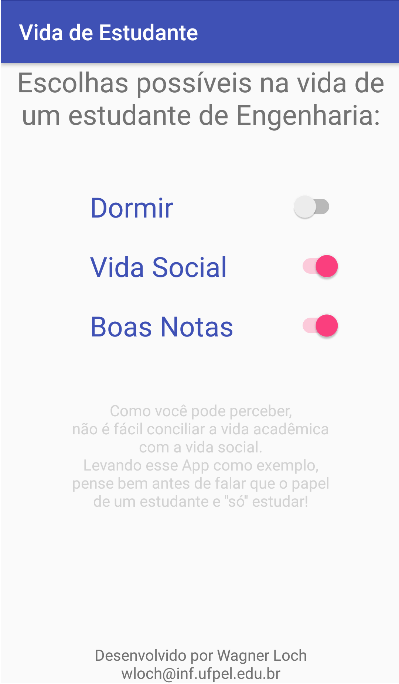
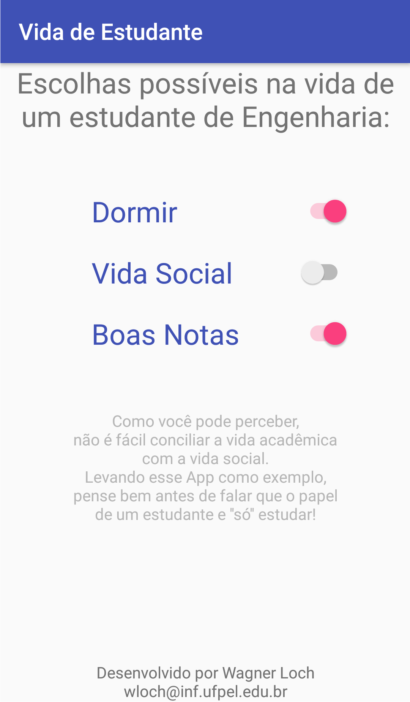
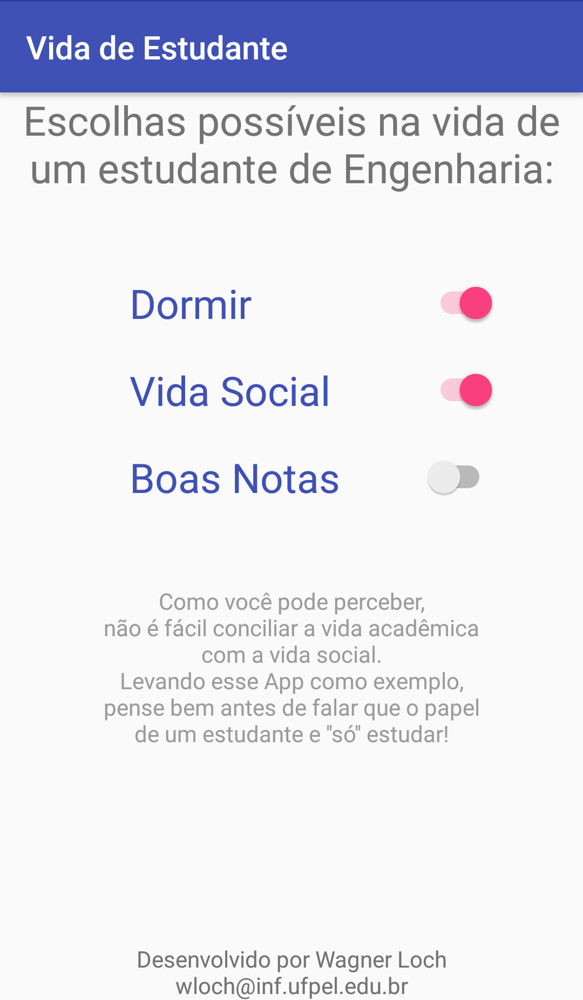
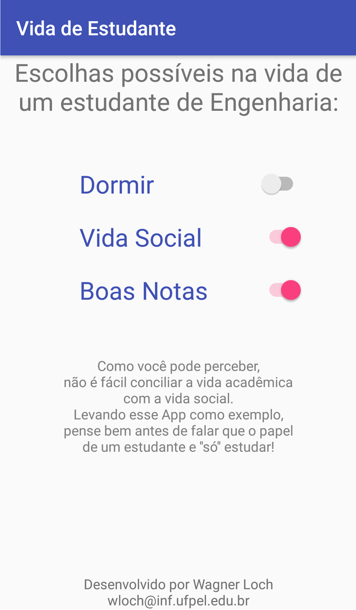

# Vida De Estudante

Aplicativo para Android que demonstra o quão difícil é a vida acadêmica impossibilitando ter uma vida social como outros.

Todos os dias somos criticados pois o único papel é o de estudar, sendo que muitas vezes ouvimos com desdém: "Mas você SÓ estuda, não faz nada o dia inteiro".

O problema é que quem fala isso não conhece realmente como é a vida acadêmica, esse app pode ajudar a entender.

[Download APK, clique aqui.](https://drive.google.com/file/d/0B25ho9lfGzeEdXp4ajU2dFBmaWs/view?usp=sharing)

Ao clicar nos botões, uma mensagem é exibida conforme pode ser visto pelas imagens abaixo:

